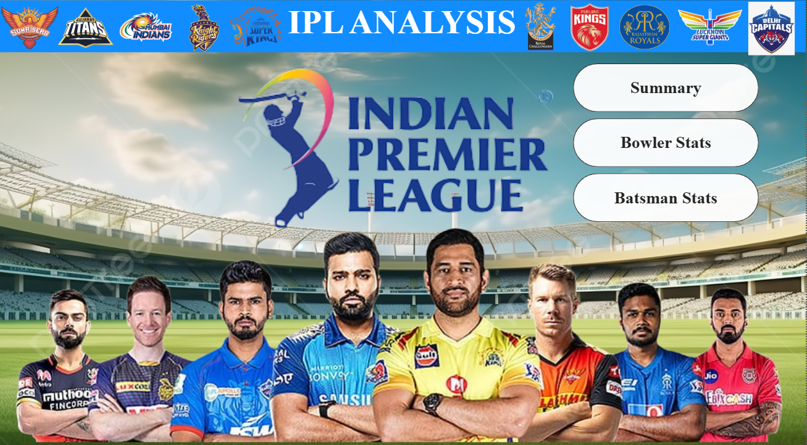
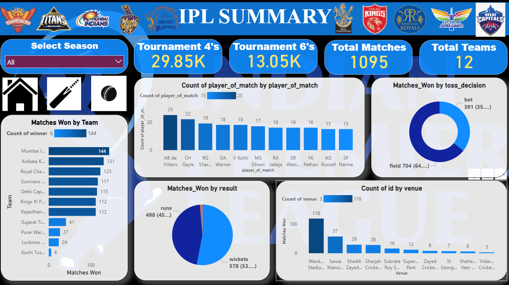

# IPL Data Analysis and Dashboard

## 📌 Overview

This project focuses on analyzing **Indian Premier League (IPL) data** using **Python (Pandas)** for data analysis and **Power BI** for creating an interactive dashboard.
The goal is to derive meaningful insights from IPL matches, players, and teams while presenting them in a visually appealing and easy-to-understand way.

## 🛠️ Tools & Technologies

* **Python (Pandas, NumPy, Matplotlib)** → Data cleaning, preprocessing & analysis
* **Power BI** → Interactive dashboard for visualization
* **Jupyter Notebook** → Exploratory data analysis (EDA)

## 🔍 Key Insights & Features

* Total runs, wickets, and match outcomes across all seasons
* Team-wise performance comparison
* Player statistics and top performers
* Toss decisions and match-winning trends
* Venue-wise analysis

## 📊 Dashboard Preview





## 🚀 How to Use

1. Clone this repository

   ```bash
   git clone https://github.com/vivekraj123456/IPL-Data-Analysis-and-Dashboard.git
   ```
2. Open `Project_IPL.ipynb` file to explore Pandas analysis.
3. Open the `ipl cricket analysis project.pbix` file in Power BI Desktop to interact with the dashboard.


